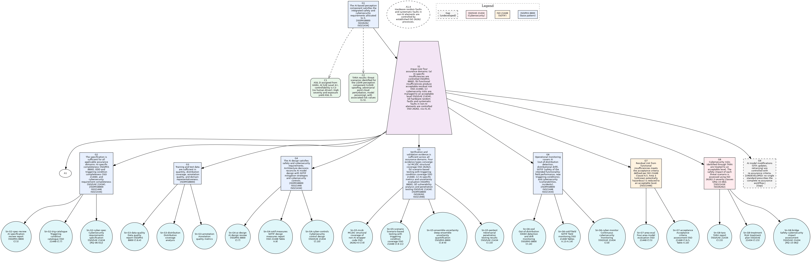

# Assurance Gaps in an Integrated Safety and Cybersecurity Case

Milin Patel and Rolf Jung, Kempten University of Applied Sciences.
Supplementary material for two SAFECOMP 2026 papers.

**The short version.** Four standards apply at once to an AI perception component
in a self-driving vehicle: ISO 26262 (functional safety), ISO 21448 (hazards from
the intended function working as designed), ISO/SAE 21434 (cybersecurity) and
ISO/PAS 8800 (safety of AI). Each one tells you what evidence to produce. We built
the single argument they jointly imply, in the notation certification engineers use
(Goal Structuring Notation, GSN), and then looked at what the combination exposes.

One node carries all four standards at once: the goal claiming that verification
and validation are sufficient. The four standards ask for four kinds of evidence
there, on four scales that do not convert into one another (a pass/fail coverage
figure, a count of scenarios, a statistical uncertainty score, and an attack
success rate). **No standard says how to combine them into one judgement.** An
engineer can complete every prescribed activity and still be unable to state
whether the evidence together is enough.



Two papers come out of this, and the camera-ready source of each is in
[`paper/`](paper/):

- [`paper/waise2026/`](paper/waise2026/) builds the argument and reports what it
  exposes. The code in `src/` backs this paper: the nine-goal pattern, the seven
  decision points, and the five findings.
- [`paper/safecomp2026-position/`](paper/safecomp2026-position/) asks the same
  question about a vehicle already on the road. An alarm fires in service and
  nobody can tell whether the cause was weather or an attack. The paper argues at
  clause level that no standard assigns that alarm to a concern. No file in `src/`
  supports it, and none is meant to.

Both papers are accepted for SAFECOMP 2026. The files here are the camera-ready
sources.


[](https://colab.research.google.com/github/milinpatel07/Assurance-Gaps-in-an-Integrated-Safety-and-Cybersecurity-Case/blob/main/notebooks/assurance_gaps_analysis.ipynb)

---

## Overview

The full title of the WAISE paper is *Integrating Cybersecurity into the AI Safety
Assurance Argument: A GSN Pattern for AI-Based Perception Components in Highly
Automated Driving*. The position paper is *Operational Safety and Cybersecurity
Assurance for AI-Based Perception in Highly Automated Driving*.

This repository holds the code behind the first of those. It runs a five-step
constructive integration: read the four standards at clause level, map the clauses
onto lifecycle phases, build the GSN argument, then examine what the finished
argument exposes. The pattern extends ISO/PAS 8800 Annex B from 6 goals to 9. It
identifies 7 decision points, which are places where the standards hand a choice
to the project rather than prescribe one. It classifies 5 findings, of which 2 are
visible only once the standards are combined and would not appear under any one of
them alone.

The case study is a LiDAR 3D object detector (three classes: car, pedestrian,
cyclist) in a vehicle with no driver to fall back on.

The GSN argument structure is defined in machine-readable YAML files (`gsn/`) and rendered to SVG using [gsn2x](https://github.com/jonasthewolf/gsn2x), an open-source tool that produces standard-compliant GSN diagrams.

## Repository Structure

```
├── gsn/                        # GSN argument patterns (YAML for gsn2x)
│   ├── integrated_pattern.gsn.yaml   # Figure 2: 9-goal integrated pattern
│   └── evidence_convergence.gsn.yaml # Figure 3: evidence convergence at G5
│
├── src/
│   ├── standards/              # Claim extraction and lifecycle mapping (Steps 1-2)
│   ├── gsn/                    # GSN data model and construction (Step 3)
│   ├── analysis/               # Inconsistency and gap analysis (Steps 4-5)
│   ├── perception/             # Case study: SECOND detector + deep ensemble
│   ├── evaluation/             # CARLA evaluation under SOTIF triggering conditions
│   ├── results/                # Output generation (JSON, CSV, LaTeX tables)
│   └── visualization/          # Matplotlib figures
│
├── paper/                      # Camera-ready sources of both papers
├── tests/                      # 192 tests
├── notebooks/                  # Interactive Jupyter/Colab notebook
├── configs/                    # YAML descriptions of the standards and case study
│                               #   (documentation only; no code loads them)
├── data/
│   ├── empirical_results/      # Measured KITTI/nuScenes results (PointPillars ensemble)
│   └── synthetic_illustrations/  # Deterministic seeded illustration outputs (seed=42)
├── docs/figures/               # Reference PNGs of figures that `make results` regenerates
├── Makefile                    # Build targets
├── REPRODUCING.md              # Reproduction guide
└── pyproject.toml
```

## Three-layer repository structure

The repository separates three kinds of artefact, which should not be conflated:

1. **Methodology** (argued) at `src/`. The five-step constructive integration
   code: claim extraction, lifecycle mapping, GSN construction, decision-point
   analysis, and findings classification, with the perception, evaluation, and
   results modules. This implements the method described in the WAISE paper.

2. **Synthetic illustrations** (seeded) at `data/synthetic_illustrations/`.
   Reference outputs of the analysis and of the illustration pipeline. The
   weather-evaluation numbers are deterministic seeded output (seed = 42). They
   show the shape of the pipeline's output and are not measurements. See
   `data/synthetic_illustrations/README.md`.

3. **Empirical evidence** (measured) at `data/empirical_results/`. AUROC and
   MDR/MFAR measured on a trained PointPillars deep ensemble over KITTI and
   nuScenes. These are the kinds of evidence G5 and G6 call for, and they were
   produced by a separate runtime-monitoring project. Neither paper cites these
   files, and no claim in either paper rests on them. The WAISE paper cites a
   different result for its G5 evidence type (c), the simulated ensemble
   disagreement reported in the VEHITS 2026 companion study. See
   `data/empirical_results/README.md` for provenance and for the reason
   PointPillars stands in for the SECOND architecture the paper names.

## GSN Diagrams

The integrated GSN argument and the evidence convergence diagram are defined as YAML files following the [gsn2x](https://github.com/jonasthewolf/gsn2x) format. This makes the argument structure machine-readable, diffable, and reproducible.

To render the diagrams:

```bash
# Download gsn2x (one-time setup)
make gsn-install

# Render all GSN diagrams to SVG
make gsn
```

`make gsn-install` fetches the Linux build of gsn2x. On Windows or macOS it will
download a binary that cannot run. Install gsn2x from its own releases page first,
put it on the path, then use `make gsn GSN2X=gsn2x`.

Or manually:

```bash
gsn2x gsn/integrated_pattern.gsn.yaml
gsn2x gsn/evidence_convergence.gsn.yaml
```

The YAML files are the single source of truth for the argument structure. Each node includes its ISO clause reference.

## Installation

```bash
git clone https://github.com/milinpatel07/Assurance-Gaps-in-an-Integrated-Safety-and-Cybersecurity-Case.git
cd Assurance-Gaps-in-an-Integrated-Safety-and-Cybersecurity-Case

pip install -e ".[dev]"
```

## Usage

```bash
# Run the test suite
make test

# Generate all results (JSON, CSV, LaTeX tables, figures)
make results

# Run the five-step analysis with console output
python -m src.analysis.run_analysis

# Generate GSN diagrams
make gsn
```

The `make results` command produces structured outputs in `output/`:
- `analysis_results.json`: the complete structured results
- `csv/`: coverage matrix, decision points, findings, counterfactual visibility, sensitivity analysis, weather evaluation
- `latex/`: 8 LaTeX tables in booktabs format for direct `\input{}` inclusion
- `figures/`: heatmaps, bar charts, and the GSN diagram (Graphviz)

## Tests

```bash
pytest tests/ -v
```

192 tests cover standards instantiation, GSN construction, inconsistency and gap classification, the perception module, the evaluation pipeline, result generation, paper claim validation, completeness checking, counterfactual analysis, generalisability classification, base pattern sensitivity, practitioner guidance, and threshold sensitivity.

The WAISE paper reports 193 tests. That count was correct when the paper was
written. The gap classification was later revised from six gaps to five, which
removed one test (commit `4d782b0`), and the suite has held at 192 since. The
number in the paper has not been changed to match, and no test was added here to
make it agree.

## Reproducibility

All evaluation results are deterministic given the same random seed. See [REPRODUCING.md](REPRODUCING.md) for step-by-step instructions.

```bash
python -m src.results.generate_all --seed 42 --scenes 50 --output output
```

## Citation

```bibtex
@inproceedings{PatelJung2026,
  author    = {Patel, Milin and Jung, Rolf},
  title     = {Integrating Cybersecurity into the {AI} Safety Assurance Argument:
               A {GSN} Pattern for {AI}-Based Perception Components in
               Highly Automated Driving},
  booktitle = {WAISE 2026 Workshop at SafeComp 2026},
  series    = {LNCS},
  publisher = {Springer},
  year      = {2026}
}
```

## License

MIT License
